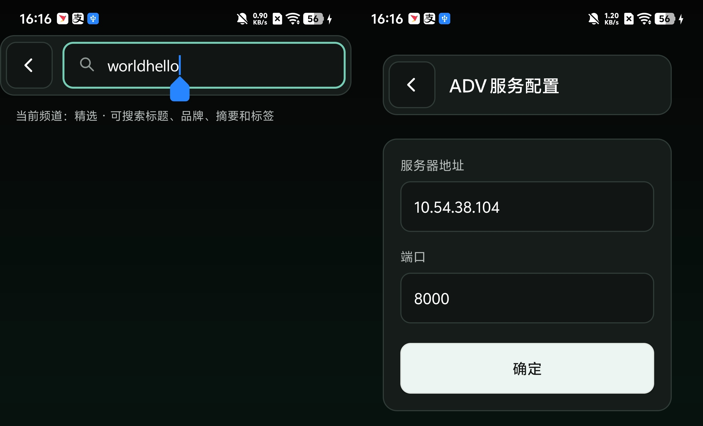
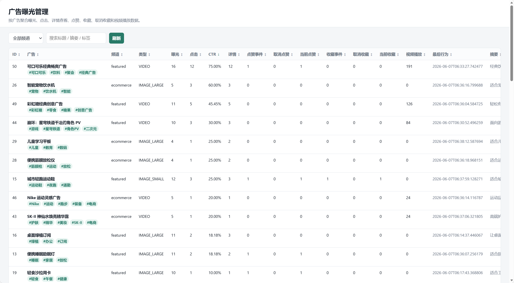

# AdFalls

> 字节跳动工程训练营，2026.05.26 - 2026.06.07  
> 
> 作者：庄里山第一忧郁 ([Jiuxiao-yunwai](https://github.com/Jiuxiao-yunwai), [Ian-Yangrau](https://github.com/Ian-Yangrau))

AdFalls 是一个“AI广告信息流”训练营题目的 Android App 项目。项目围绕广告推荐流的浏览体验、卡片动态展示、详情页互动、视频播放复用、AI 摘要标签、对话式搜索和曝光统计展开，实现了一个“端侧信息流 + 后端服务 + AI 能力 + 统计后台”的完整 Demo。

本项目采用 **Kotlin + XML + RecyclerView + Room + Media3 ExoPlayer** 实现 Android 客户端，并使用 **Python + FastAPI + SQLite** 搭建简易后端服务。广告数据支持本地 Mock、后端分页、随机刷新、搜索、收藏/点赞/曝光行为上报，以及 AI 对话式推荐和单条广告分析。

---

## 1. 题目背景

在内容与广告混排的推荐场景中，用户是否愿意停留，主要取决于两类能力：

1. **信息流呈现质量**：包括列表布局、卡片样式、滚动性能、加载体验、页面跳转和互动反馈。
2. **内容理解能力**：包括广告摘要、智能标签、自然语言搜索和更符合用户意图的推荐结果。

本项目实现一个单列广告信息流 App，用户可以在不同频道中浏览广告，查看大图、小图和视频广告卡片，进入详情页进行点赞、收藏、分享等互动，并通过 AI 对话搜索自然语言描述想看的广告。

---

## 2. 项目功能完成情况

### 2.1 核心交互

| 功能点         | 完成情况 | 说明                          |
| ----------- | ---- | --------------------------- |
| 单列广告信息流     | 已完成  | 使用 RecyclerView 实现单列广告列表    |
| 流畅滚动与列表复用   | 已完成  | Adapter 支持多类型 ViewHolder 复用 |
| 卡片多样式       | 已完成  | 支持大图、小图、视频三种广告卡片            |
| 顶部 Tab 切换频道 | 已完成  | 支持精选、电商、本地频道切换              |
| 切换频道刷新数据    | 已完成  | 切换频道后加载对应频道广告               |
| 返回保持列表位置    | 已完成  | 详情页返回后保持原信息流位置              |
| 下拉刷新        | 已完成  | SwipeRefreshLayout 触发刷新     |
| 上拉加载更多      | 已完成  | 滚动到底部自动加载下一页                |
| 详情页         | 已完成  | 展示广告图文、视频、摘要、标签和互动状态        |
| 标签点击过滤     | 已完成  | 点击标签后筛选当前频道广告                |

### 2.2 资源复用

| 功能点     | 完成情况 | 说明                                  |
| ------- | ---- | ----------------------------------- |
| Cell 复用 | 已完成  | RecyclerView 多类型 ViewHolder 复用      |
| 播放器资源复用 | 已完成  | 使用 Media3 ExoPlayer，并设计共享播放器池       |
| 缓存池设计   | 已完成  | VideoPlaybackPool 统一管理播放器绑定、暂停和播放进度 |
| 视频离屏暂停  | 已完成  | 视频完全离屏后自动暂停                         |
| 视频入屏播放  | 已完成  | 视频广告完全进入可视区域后自动播放                   |

### 2.3 数据与状态同步

| 功能点      | 完成情况 | 说明                         |
| -------- | ---- | -------------------------- |
| 数据获取     | 已完成  | 支持 FastAPI 后端（保留本地 Mock 降级） |
| 数据生命周期管理 | 已完成  | Repository 统一管理数据读写        |
| 本地缓存     | 已完成  | Room 保存广告、互动和统计状态          |
| 跨页面状态同步  | 已完成  | 列表页和详情页观察同一份数据             |
| 点赞/收藏同步  | 已完成  | 信息流和详情页状态一致                |
| 视频状态管理   | 已完成  | 支持播放、暂停、静音、进度保留            |
| 静音状态共享   | 已完成  | 信息流视频间共享静音状态               |

### 2.4 动画与交互反馈

| 功能点      | 完成情况 | 说明                      |
| -------- | ---- | ----------------------- |
| Tab 切换动效 | 已完成  | 顶部频道切换带滑动反馈             |
| 点赞/收藏交互  | 已完成  | 支持本地状态更新和后端同步           |
| 视频控件动效   | 已完成  | 点击后显示播放按钮和进度条，短时间无操作后隐藏 |
| 详情页交互    | 已完成  | 支持广告详情互动与 AI 分析         |

### 2.5 埋点统计

| 功能点    | 完成情况 | 说明                                  |
| ------ | ---- | ----------------------------------- |
| 曝光统计   | 已完成  | 广告进入可视区域后记录曝光                       |
| 点击统计   | 已完成  | 点击卡片进入详情时记录点击                       |
| 点赞、收藏统计   | 已完成  | 记录点赞、收藏、去掉点赞、取消收藏等行为                         |
| 视频播放统计 | 已完成  | 视频播放行为可上报                           |
| 后台可视化  | 已完成  | `/admin/exposure` 页面展示曝光、点击、CTR 等指标 |

### 2.6 AI 可选功能

| 功能点        | 完成情况 | 说明                           |
| ---------- | ---- | ---------------------------- |
| 广告摘要       | 已完成  | 广告数据中包含摘要字段，可由生成脚本或后端数据提供    |
| 智能标签       | 已完成  | 在广告数据进入后端时候进行 |
| 对话式搜索      | 已完成  | 用户输入自然语言，后端返回匹配广告            |
| 单条广告 AI 分析 | 已完成  | 详情页支持“让 AI 分析”，|

---

## 3. 技术栈

### Android 客户端

| 模块    | 技术                        |
| ----- | ------------------------- |
| 开发语言  | Kotlin                    |
| UI 方案 | XML Layout                |
| 架构模式  | MVVM                      |
| 列表组件  | RecyclerView              |
| 页面状态  | ViewModel + StateFlow     |
| 本地数据库 | Room / SQLite             |
| 视频播放  | AndroidX Media3 ExoPlayer |
| 网络请求  | 后端接口封装                    |
| 数据格式  | JSON                      |

### 后端服务

| 模块    | 技术                 |
| ----- | ------------------ |
| 服务框架  | Python + FastAPI   |
| 数据库   | SQLite             |
| ORM   | SQLAlchemy         |
| 接口文档  | FastAPI Swagger UI |
| AI 接口 | OpenAI 兼容文本接口      |
| 管理后台  | FastAPI HTML 页面    |

---

## 4. 项目结构

```text
AdFalls/
├── app/                                # Android 客户端
│   └── src/main/
│       ├── java/com/example/adfalls/
│       │   ├── ui/
│       │   │   ├── feed/              # 信息流首页与广告卡片 Adapter
│       │   │   ├── detail/            # 广告详情页
│       │   │   └── aichat/            # AI 对话式搜索页
│       │   ├── viewmodel/             # Feed、Detail、AI Chat 页面状态
│       │   ├── data/
│       │   │   ├── model/             # 广告、频道、卡片类型、聊天消息模型
│       │   │   ├── local/             # Room Entity、DAO、Database
│       │   │   ├── remote/            # 后端接口 DTO 和远程数据源
│       │   │   └── repository/        # 数据读写、状态同步、搜索和降级逻辑
│       │   └── cache/                 # 视频播放器复用池
│       └── res/
│           └── layout/
│               ├── item_ad_large.xml  # 大图广告卡片
│               ├── item_ad_small.xml  # 小图广告卡片
│               └── item_ad_video.xml  # 视频广告卡片
│
├── backend/                            # FastAPI 后端服务
│   ├── app/
│   │   ├── main.py                    # 后端入口
│   │   ├── models/                    # 数据库模型
│   │   ├── schemas/                   # 请求/响应结构
│   │   ├── routers/                   # 广告、AI、用户、统计接口
│   │   └── services/                  # AI 调用、广告推荐、统计逻辑
│   ├── scripts/
│   │   └── generate_ads_data.py       # 测试广告数据生成脚本
│   └── requirements.txt
│
├── data/                               # 广告数据文件
│   ├── ads.csv
│   ├── ads.json
│   └── image_prompts.json
│
├── materials/                          # 图片、视频素材目录
│   ├── images/
│   └── videos/
│
├── docs/                               # 技术设计文档
│   ├── README.md
│   ├── 项目管理/
│   ├── 架构设计/
│   └── 阶段设计/
│
├── build.gradle.kts
├── settings.gradle.kts
└── README.md
```

---

## 5. 架构设计

项目采用分层结构，核心数据流如下：

```text
Activity / Fragment
        ↓
ViewModel
        ↓
Repository
        ↓
Room / Remote / AI Service / Mock
```

### 5.1 分层职责

| 层级           | 职责                              |
| ------------ | ------------------------------- |
| UI 层         | 展示页面、绑定点击事件、处理刷新、滚动和跳转          |
| ViewModel 层  | 保存页面状态，处理交互逻辑，向 Repository 发起请求 |
| Repository 层 | 统一管理数据来源、本地缓存、远程请求和降级逻辑         |
| Room 层       | 保存广告数据、互动状态、曝光点击等统计字段           |
| Remote 层     | 负责后端接口请求和 DTO 转换                |
| AI 层         | 处理广告摘要、标签、对话式搜索和广告分析            |
| Cache 层      | 复用视频播放器资源，降低频繁创建播放器的开销          |

### 5.2 信息流数据流

```text
Feed 页面
    -> FeedViewModel
    -> AdRepository
    -> Remote / Room
    -> RecyclerView 多类型卡片展示
```

用户下拉刷新或上拉加载时，Repository 请求后端分页接口，将结果写入 Room，再由页面状态更新列表。

### 5.3 详情页状态同步

```text
列表点击 adId
    -> DetailActivity
    -> DetailViewModel
    -> 观察 Room 中同一条广告数据
```

点赞、收藏、分享等互动会写入 Room，并同步到后端。由于列表页和详情页观察同一份数据，所以返回信息流后状态保持一致。

### 5.4 AI 对话式搜索数据流

```text
AiChatActivity
    -> AiChatViewModel
    -> AiChatRepository
    -> AiChatRemoteDataSource
    -> FastAPI AI 接口
    -> AiChatMessage
    -> RecyclerView 聊天消息展示
```

UI 和 ViewModel 不直接依赖服务端 JSON，只处理页面消息模型。DTO 转换集中在 Repository 和 Remote 层，便于后续替换不同 AI 服务。

---

## 6. 运行方式

### 6.1 运行 Android 客户端

在项目根目录执行：

```bash
./gradlew :app:assembleDebug
```

Windows 下执行：

```powershell
.\gradlew.bat :app:assembleDebug
```

构建产物位于：

```text
app/build/outputs/apk/debug/app-debug.apk
```

可以使用 Android Studio 打开项目后直接运行 `app` 模块。

---

### 6.2 启动后端服务

进入后端目录：

```powershell
cd backend
python -m venv .venv
.\.venv\Scripts\Activate.ps1
pip install -r requirements.txt
```

启动服务：

```powershell
python -B -m uvicorn app.main:app --host 0.0.0.0 --port 8000 --reload
```

启动后访问接口文档：

```text
http://127.0.0.1:8000/docs
```

Android 模拟器默认通过以下地址访问宿主机服务：

```text
http://10.0.2.2:8000
```

如果使用真机调试，需要将 `app/build.gradle.kts` 中的 `ADFALLS_API_BASE_URL` 修改为电脑局域网 IP （通过服务器的`ipconfig`指令获取），例如：

```kotlin
buildConfigField("String", "ADFALLS_API_BASE_URL", "\"http://192.168.1.8:8000\"")
```

如果已构建，可以通过APP搜索框输入 `worldhello` 文本进入配置页面，手动替换服务器地址与端口，之后重启安卓APP即可。



---

## 7. 后端接口

后端主要接口如下：

```text
GET    /api/ads/feed
GET    /api/ads/{id}
GET    /api/ads/search
POST   /api/ai/chat-search
POST   /api/ai/ad-analysis
POST   /api/behavior
POST   /api/user/login
GET    /api/user/{userId}/favorites
POST   /api/user/{userId}/favorites/{adId}
DELETE /api/user/{userId}/favorites/{adId}
POST   /api/user/{userId}/likes/{adId}
DELETE /api/user/{userId}/likes/{adId}
GET    /api/admin/ads/metrics
GET    /admin/exposure
```

统一响应格式：

```json
{
  "code": 200,
  "message": "success",
  "data": {}
}
```

---

## 8. AI 接入说明

### 8.1 环境变量配置

如果需要启用真实 AI 推荐和广告分析，需要复制`backend\.env.example` 为 `backend/.env` ，之后配置文本模型接口：

```text
ADFALLS_TEXT_API_KEY=你的 API Key
ADFALLS_TEXT_API_BASE_URL=https://token-plan-cn.xiaomimimo.com/v1
ADFALLS_TEXT_MODEL=mimo-v2.5
ADFALLS_TEXT_API_TIMEOUT=60
```

之后重启后端服务。

注意：API Key 只应放在本地 `.env` 文件中，不应提交到 GitHub。

### 8.2 AI 能力使用位置

| 使用位置     | 功能                 |
| -------- | ------------------ |
| AI 对话搜索页 | 用户用自然语言描述需求，返回匹配广告 |
| 广告详情页    | 对单条广告进行介绍  |

### 8.3 AI 输出约束

为保证结果稳定，项目对 AI 输出做了结构化约束：

1. 广告摘要应简短，适合作为卡片副标题或详情摘要。
2. 标签应为短词，便于在卡片上展示和点击筛选。
3. 对话式搜索应返回广告推荐结果，而不是泛泛聊天。
4. 单条广告分析只分析当前广告，不返回无关广告。
5. 如果 AI 接口不可用，后端使用兜底数据或 Mock 逻辑，保证 App 仍可运行。

---

## 9. 广告数据准备

仓库中已有少量示例广告数据

```text
data/
  ads.json
materials/
  images/
  videos/
```

如果需要自行改变广告内容，需严格遵守约定，并且重新启动后端之前应该清理根目录下的`adfalls.db`文件。

---

## 10. 曝光统计与后台管理

后端提供轻量管理页：

```text
http://127.0.0.1:8000/admin/exposure
```

该页面可以查看：

* 曝光数
* 点击数
* 详情查看数
* 点赞事件数
* 取消点赞数
* 当前点赞数
* 收藏事件数
* 取消收藏数
* 当前收藏数
* 视频播放数
* CTR



## 11. 关键难点与解决方案

### 11.1 卡片动态化方案

题目要求广告卡片支持多样式，因此项目没有使用单一布局，而是通过 RecyclerView 多类型 ViewHolder 实现：

* 大图广告卡片
* 小图广告卡片
* 视频广告卡片

不同广告类型由数据模型中的类型字段决定，Adapter 根据类型创建不同布局。这样可以在不改变信息流整体结构的情况下扩展更多卡片样式。

### 11.2 列表性能策略

信息流性能主要从以下方面处理：

1. 使用 RecyclerView 进行 Cell 复用。
2. 多类型卡片只绑定必要数据。
3. 视频播放器不随 ViewHolder 频繁创建，而是由共享播放器池管理。
4. 视频完全入屏才自动播放，完全离屏后自动暂停。
5. 播放、暂停、静音等轻量状态通过局部刷新处理，避免整卡重绑造成闪屏。
6. 分页加载控制单次数据量，避免一次性加载过多广告。

### 11.3 播放器资源复用

视频广告如果每个卡片都创建独立播放器，会造成资源浪费和滚动卡顿。因此项目设计了 `VideoPlaybackPool`：

* 同一时间只允许一个视频处于播放状态。
* 视频卡片进入可视区域后绑定播放器。
* 视频离屏后暂停并保存播放进度。
* 静音状态在信息流视频之间共享。
* 详情页返回后可以恢复信息流状态。

### 11.4 数据与状态同步

信息流和详情页都需要展示点赞、收藏、统计等状态。如果只在页面内保存状态，容易出现返回后数据不一致的问题。

项目采用 Room 作为本地状态中心：

```text
列表页观察 Room
详情页观察 Room
互动行为写入 Room
后端同步行为事件
```

这样列表和详情读取的是同一份数据，状态同步更加稳定。

### 11.5 AI 输出与缓存策略

AI 能力存在响应慢、格式不稳定、接口不可用等问题，因此项目采用以下策略：

1. 摘要和标签提前写入广告数据，减少列表实时等待。
2. 对话式搜索只返回结构化推荐结果，不直接让 UI 解析自由文本。
3. 单条广告分析限制在当前广告范围内，避免结果跑偏。
4. 服务不可用时使用本地兜底逻辑，保证核心功能可演示。
5. API Key 使用环境变量配置，不写入代码仓库。

### 11.6 曝光统计口径

曝光统计采用“广告进入可视区域后记录”的思路。点击、详情、点赞、收藏、视频播放等行为通过后端接口上报，并在后台页面中按广告聚合展示。CTR 使用点击数和曝光数计算，用于观察广告卡片表现。

---

## 12. 方案对比

### 12.1 UI 技术方案对比

| 方案                 | 优点                      | 缺点                                  | 选择  |
| ------------------ | ----------------------- | ----------------------------------- | --- |
| XML + RecyclerView | 成熟稳定，适合训练营快速实现，列表复用机制清晰 | UI 声明式能力不如 Compose                  | 采用  |
| Jetpack Compose    | 写法现代，状态驱动 UI 更自然        | 对复杂 RecyclerView、视频复用和 XML 项目迁移成本较高 | 未采用 |

最终选择 XML + RecyclerView，因为题目重点是信息流性能、卡片复用、状态同步和视频资源管理，传统方案更稳定，也更容易在短周期内完成。

### 12.2 数据方案对比

| 方案        | 优点           | 缺点                  | 选择          |
| --------- | ------------ | ------------------- | ----------- |
| 纯内存 Mock  | 实现最快         | 页面重建后状态丢失，列表和详情同步困难 | 仅作为早期验证     |
| Room 本地缓存 | 状态稳定，支持跨页面同步 | 需要设计 Entity 和 DAO   | 采用          |
| 纯后端实时请求   | 数据统一         | 弱网时体验差，状态同步依赖网络     | 与 Room 结合使用 |

最终采用 Room + Repository + 后端接口的混合方案。Room 负责本地状态和页面同步，后端负责数据分页、AI 能力和统计聚合。

### 12.3 AI 接入方案对比

| 方案         | 优点                 | 缺点                    | 选择     |
| ---------- | ------------------ | --------------------- | ------ |
| 端侧直接调用大模型  | 客户端实现简单            | API Key 不安全，网络与格式控制困难 | 未采用    |
| 后端封装 AI 接口 | 安全性更好，便于统一提示词和输出格式 | 需要额外后端服务              | 采用     |
| 完全本地 Mock  | 稳定、无成本             | AI 效果不真实              | 作为降级方案 |

最终采用后端封装 AI 接口，并保留本地兜底能力。

---

## 13. 效果评估

项目从以下维度评估完成度：

### 13.1 功能完整性

* 核心信息流浏览流程完整。
* 支持频道切换、刷新、加载更多。
* 支持大图、小图、视频三类广告。
* 支持详情页和返回位置保持。
* 支持点赞、收藏、分享、标签筛选。
* 支持 AI 对话搜索和广告分析。
* 支持曝光、点击、视频播放等统计。

### 13.2 稳定性

* 后端不可用时保留 Mock 降级。
* AI 接口不可用时不影响核心浏览。
* 视频播放器统一复用，降低资源占用。
* 状态通过 Room 管理，避免页面间状态不一致。

### 13.3 工程质量

* 客户端按 MVVM 分层。
* 数据访问集中在 Repository。
* UI 层不直接处理复杂数据来源。
* 后端接口统一响应格式。
* API Key 使用环境变量配置。
* 技术设计文档放在 `docs/` 目录中，便于答辩说明。

---

## 14. AI 使用声明

本项目开发过程中使用了 AI 辅助完成部分内容，主要包括：

1. 辅助梳理题目要求和功能拆分。
2. 辅助生成产品图标。
3. 辅助生成部分广告数据、摘要、标签和图片提示词。
4. 辅助进行部分代码的编写。
5. 辅助检查部分代码结构和实现思路。
6. 辅助进行前端代码的设计与部分实现。
7. 辅助进行后端整体结构的搭建。

对 AI 结果的验证方式：

1. 对生成的代码进行人工检查和运行验证。
2. 对广告摘要、标签进行人工筛选，避免明显不符合广告内容。
3. 对 AI 接口输出增加结构化约束，减少自由文本导致的解析问题。


本项目的核心架构、功能取舍、页面交互、状态同步、视频复用和后端接口设计均经过人工理解、调整和验证。

---

## 15. 开发规范

1. 客户端使用 Kotlin 编写，保持统一命名风格。
2. UI 层只负责展示和事件分发，不直接写复杂业务逻辑。
3. ViewModel 负责页面状态管理。
4. Repository 负责数据来源整合和降级逻辑。
5. Room 作为本地状态中心，避免内存状态分散。
6. 后端接口统一返回 `code/message/data` 格式。
7. API Key、数据库文件、临时构建产物不提交到仓库。
8. 关键逻辑保留必要注释，尤其是视频复用、曝光统计和 AI 输出处理。

---

## 16. 交付物说明

| 交付物       | 位置           | 说明                        |
| --------- | ------------ | ------------------------- |
| GitHub 仓库 | 当前仓库         | 包含 Android 客户端、后端、数据脚本和文档 |
| README    | `README.md`  | 项目介绍、运行方式、模块划分、AI 声明      |
| 技术设计文档    | `docs/`      | 架构设计、数据状态设计、阶段设计和项目管理     |
| 后端服务      | `backend/`   | FastAPI 广告接口、AI 接口、统计接口   |
| 测试广告数据    | `data/`      | 广告 JSON/CSV 和图片提示词        |
| 素材目录      | `materials/` | 图片和视频素材                   |
| 演示视频      | `video.mp4`    | 展示信息流、刷新加载、摘要标签、详情互动、对话搜索 |

---

## 17. 后续改进方向

1. 接入真实图片/视频 CDN，完善素材加载和缓存。
2. 对 AI 输出增加 JSON Schema 校验。
3. 引入用户画像，更好进行广告的推荐。
4. 在后端实现RAG等增强检索方法，优化AI对话体验。
5. 增加端侧测试用例和接口测试脚本。
6. 支持更多广告卡片样式，例如横滑图集、优惠券卡片、直播卡片。
7. 完善登录态和多用户收藏隔离。
